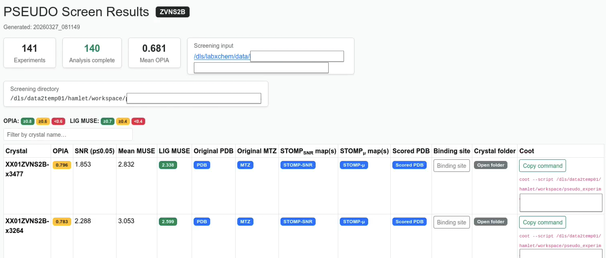

# Analyse Guide

The **Analyse** module scores every heavy atom in the model against the debiased SNR map using **MUSE** (Model Uncertainty Score Estimator). MUSE adapts the EDIA methodology to any scalar field.

In **screening mode** (multiple experiments in one directory) the module also generates an interactive HTML summary report — the **Screen Report** — covering all crystals in a single sortable table.

---

## Quick start

```bash
# Single experiment
pseudo-analyse --input_path /scratch/results/my_experiment

# Screening run (all crystals in the directory)
pseudo-analyse --input_path /scratch/results/my_screen --num_processes 8
```

---

## CLI options

| Flag | Short | Default | Description |
|---|---|---|---|
| `--input_path` | `-p` | *required* | Workspace root or single experiment directory. |
| `--stem` | `-s` | auto | Explicit experiment stem. |
| `--map_path` | `-m` | auto | Custom CCP4 map instead of the auto-discovered SNR map. |
| `--model_path` | | auto | Custom PDB/CIF instead of the processed model. |
| `--k_factor` | `-k` | `1.0` | K factor used to locate the SNR map in `quantify_results/`. |
| `--map_cap` | `-c` | `50` | Map cap used to locate the SNR map. Pass `0` for auto-detect. |
| `--num_processes` | `-n` | `1` | Parallel workers for screening mode. |
| `--significance_alpha` | `-a` | `0.05` | Significance level α for the null-distribution threshold. |

---

## Python API

```python
from analyse.api import run_analysis

run_analysis(
    input_path="/scratch/results/my_experiment",
    significance_alpha=0.05,
    num_processes=4,     # parallel for screening
)
```

### Using MUSE directly

```python
from analyse.muse.pipeline import run_muse, export_residue_csv, export_summary

result = run_muse(
    map_path="target_snr.ccp4",
    structure_path="target_updated.pdb",
    resolution=2.0,
)

print(export_summary(result))
export_residue_csv(result, "residues.csv")
```

---

## Outputs

### Per-experiment files

Written to `<crystal>/analyse_results/`:

| File | Description |
|---|---|
| `{stem}_atoms.csv` | Per-atom MUSE score, `score_positive`, `score_negative`, diagnostic flags |
| `{stem}_residues.csv` | Per-residue MUSEm, min/median/max atom score, diagnostic counts |
| `{stem}_summary.json` | Global statistics: OPIA, atom/residue counts, thresholds |
| `{stem}_scored.pdb` | Original structure with MUSE scores in the B-factor column (×100) |

### Screening mode files

When multiple experiments are found the following are written to the screening root:

| File | Description |
|---|---|
| `index.html` | Interactive HTML screen report (see below) |
| `metadata/{stem}_screen_result.json` | Full per-experiment result dictionary |
| `metadata/screen_summary_{timestamp}.json` | Run-level summary: experiment list, mean OPIA, counts |
| `coot/{stem}_coot_view.py` | Auto-generated Coot session script per crystal |

---

## Screen Report

The screen report is an interactive, self-contained HTML file written to `<screening_dir>/index.html`.
It aggregates every crystal's MUSE results into one sortable table and provides direct links and Coot integration.

<p align="center">
  
</p>

### Summary cards

The top of the page shows run-level summary cards:

| Card | Description |
|---|---|
| **Experiments** | Total number of crystals discovered |
| **Analysis complete** | Crystals for which `analyse_results/` exist |
| **Mean OPIA** | Average OPIA across all completed crystals |
| **Screening input** | Inferred original screening project directory |
| **Screening directory** | Path to the PSEUDO workspace root |

### Table columns

| Column | Description                                                                                  |
|---|----------------------------------------------------------------------------------------------|
| **Crystal** | Experiment stem (crystal name)                                                               |
| **OPIA** | Overall Per-instance Agreement: fraction of atoms with sufficient density support            |
| **SNR (p≤0.05)** | The STOMP-SNR value at significance level p = 0.05, derived from the fitted null distribution |
| **Mean MUSE** | Mean per-atom MUSE score across the whole structure                                          |
| **LIG MUSE** | MUSEm score for the ligand residue (default `LIG`)                                           |
| **Original PDB** | Link to the input structure file                                                             |
| **Original MTZ** | Link to the input reflections file                                                           |
| **STOMP_SNR map(s)** | Link(s) to the STOMP SNR map(s) in `quantify_results/`                                       |
| **STOMP_μ map(s)** | Link(s) to the STOMP mean map(s) in `quantify_results/`                                      |
| **Scored PDB** | Link to `{stem}_scored.pdb` with MUSE scores in the B-factor column for PyMol visualization  |
| **Binding site** | Toggle button revealing a table of all residues within 10 Å of the ligand                    |
| **Crystal folder** | Clickable link that opens the original crystal input directory in the file manager           |
| **Coot** | "Copy command" button and selectable `coot --script …` command for Coot session loading |

### Coot integration

Each crystal has a pre-generated Coot session script at `coot/{stem}_coot_view.py`.
Clicking **Copy command** copies the full `coot --script <path>` command to the clipboard.

Running the script in Coot loads:

| Map | Colour | Level                                 |
|---|---|---------------------------------------|
| Original MTZ reflections | Brick red `(0.80, 0.25, 0.10)` | σ = 1.0                               |
| STOMP_μ (mean map) | Forest green `(0.14, 0.55, 0.13)` | σ = 1.0                               |
| STOMP_SNR map | Golden `(0.85, 0.65, 0.13)` | Absolute STOMP SNR (p≤0.05) threshold |

```bash
# Make sure that coot is in your PATH
coot --version 

# Or load coot. 
module load coot 

# For Diamond users coot is part of the ccp4 module:
module load ccp4

# Run from a terminal for visualisation
coot --script /path/to/coot/XX01ZVNS2B-x0051_coot_view.py
```

### Regenerating the report

The report can be regenerated at any time without re-running analysis using the standalone command:

```bash
pseudo-screen-report --input_path /scratch/results/my_screen
pseudo-screen-report --input_path /scratch/results/my_screen --open_browser
```

`--open_browser` opens `index.html` in the default browser immediately after generation

### Python API

```python
from analyse.screen_report import generate_screen_report

generate_screen_report(
    screening_dir="/scratch/results/my_screen",
    lig_resname="LIG",          # residue name to score and centre Coot on
    neighbourhood_radius=10.0,  # Å radius for binding-site table
    open_browser=False,
)
```

---

## Visualisation

Load `{stem}_scored.pdb` in PyMOL and colour by B-factor:

```text
# PyMOL
load target_scored.pdb
spectrum b, red_white_blue
```

### Python plots

```python
from analyse.visualization import extract_residue_scores, plot_residue_profile, plot_water_support

scores = extract_residue_scores(result, score_field="musem", chain_id="A")
fig = plot_residue_profile(scores, title="Chain A — MUSE profile")
fig.savefig("chain_a_profile.pdf")

fig2 = plot_water_support(result, threshold=0.5)
fig2.savefig("water_support.pdf")
```

---

## Significance threshold

When null-distribution parameters are present in `metadata/` (produced by `pseudo-quantify`), `pseudo-analyse` automatically sets the OPIA and missing-density thresholds to the SNR value at `p = significance_alpha`. This adapts the scoring to the actual noise floor of the experiment. The threshold is reported in the **SNR (p≤0.05)** column of the screen report and embedded in `{stem}_summary.json` as `significance_snr_threshold`.

---

## MUSE configuration

```python
from analyse.muse.config import MUSEConfig, AggregationConfig, MapNormalizationConfig
from analyse.muse.pipeline import run_muse

config = MUSEConfig(
    map_normalization=MapNormalizationConfig(normalize=True),   # for 2Fo-Fc maps
    aggregation=AggregationConfig(opia_threshold=0.7),
)
result = run_muse("map.ccp4", "model.pdb", resolution=1.8, config=config)
```

See [Configuration Reference — MUSE](../reference#muse-scoring-parameters-museconfig) for all parameters.

---

## HPC / SLURM submission

For fragment screening workspaces, wrap the command in `sbatch` and use `--num_processes` to parallelise across crystals within the job:

```bash
sbatch --partition cs05r \
       --cpus-per-task 8 \
       --mem-per-cpu 5G \
       --time 3-00:00:00 \
       --wrap "pseudo-analyse --input_path /scratch/results/my_screen \
                              --num_processes 8"
```

`--num_processes` controls how many crystals are processed in parallel inside the job. Set it to match `--cpus-per-task`.

---

## References

1. Meyder et al. (2017) *J. Chem. Inf. Model.* **57**, 2437–2447.
2. Nittinger et al. (2015) *J. Chem. Inf. Model.* **55**, 771–783.